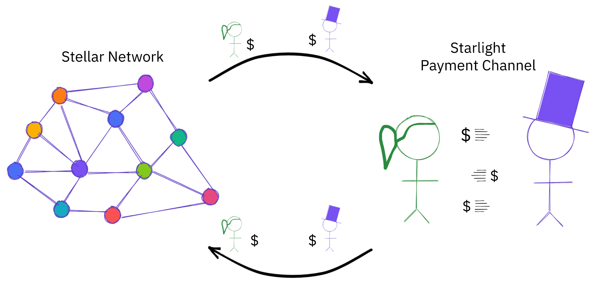

<div align="center">
<a href="https://stellar.org"></a>
<br/>
<strong>Creating equitable access to the global financial system</strong>
<h1>Starlight Protocol</h1>
</div>
<p align="center">
<a href="https://github.com/stellar/starlight/actions/workflows/sdk.yml">
<a href="https://pkg.go.dev/github.com/stellar/starlight/sdk"></a>
<a href="https://github.com/stellar/starlight/discussions"></a>
</p>

Starlight is a prototype layer 2 payment channel protocol for the Stellar Network. Starlight has existed in a couple different forms. The previous version of Starlight lives at [interstellar/starlight](https://github.com/interstellar/starlight).
  
**Have a use case for payment channels on Stellar? Tell us about it [here](https://github.com/stellar/starlight/discussions/new?category=use-cases).**

This repository contains a experiments, prototypes, documents, and issues
relating to implementing the Starlight protocol on the Stellar network.
Protoypes here are dependent on Core Advancement Protocols, [CAP-21] and
[CAP-40], that are not yet accepted or implemented. You can experiment with the
Starlight protocol by using the devnet, or running a private Stellar network in
a docker container. To find out how, see [Getting
Started](Getting%20Started.md).



The Starlight protocol, SDK, code in this repository, and any forks of other Stellar software referenced here, are **experimental** and **not recommended for use in production** systems. Please use the SDK to experiment with payment channels on Stellar, but it is not recommended for use with assets that hold real world value.

## Try it out

The devnet is a development network with partial implementations of CAP-21 and
CAP-40, required for the Starlight protocol. It is intended for convenient use
with examples or testing. It has no uptime or data durability guarantees and a
network reset occurs when deployed.

Horizon: https://horizon-devnet-cap21and40.stellar.org  
Network Passphrase: `Starlight Network; October 2021`

To run the example console application with the deployed devnet:

```
git clone https://github.com/stellar/starlight
cd examples/console
go run . -horizon=http://horizon-devnet-cap21and40.stellar.org
>>> help
```

Run two copies of the example console application and connect them directly over
TCP to open a payment channel between two participants.
More details in the [README](https://github.com/stellar/starlight/tree/main/examples/console).

## Get involved

- [Discussions](https://github.com/stellar/starlight/discussions)
- [Demos](https://github.com/stellar/starlight/discussions/categories/demos)
- [Getting Started](Getting%20Started.md)
- [Specifications](specifications/)
- [Benchmarks](benchmarks/)

## Build and experiment

- [SDK](https://pkg.go.dev/github.com/stellar/starlight/sdk)
- [Examples](examples/)

## Discussions

- Discussions about Starlight are on [GitHub Discussions](https://github.com/stellar/starlight/discussions)
- Discussions about CAP-21 and CAP-40:
  - CAP-21 thread on the [stellar-dev mailing list](https://groups.google.com/g/stellar-dev/c/Wp7gNaJvt40)
  - CAP-40 thread on the [stellar-dev mailing list](https://groups.google.com/g/stellar-dev/c/Wp7gNaJvt40)
  - Live Protocol Meetings: https://www.youtube.com/playlist?list=PLmr3tp_7-7Gj9cTR5ieSaRHxiA2zItFyx

## Forks

The code in this repository is dependent on some other Stellar software that have been forked to add partial implementations of [CAP-21] and [CAP-40].

- xdr: https://github.com/stellar/stellar-core-experimental-cap21and40/tree/cap21and40/src/xdr
- stellar-core: https://github.com/stellar/stellar-core-experimental-cap21and40/pull/1
- horizon & Go SDK: https://github.com/stellar/go/pull/4013
- quickstart: https://github.com/stellar/docker-stellar-core-horizon/pull/294
- stc: https://github.com/leighmcculloch/xdrpp--stc/pull/1

### CAP-21

The forks may not be exactly the same as CAP-21 defines as shortcuts were taken, however should be functionally equivalent. Not all general preconditions were implemented. Horizon was updated to expose the preconditions and new accounts state that is helpful to Starlight as a bare minimum, but not all because payment channels primariliy need these capabilities in the transactions and don't necessarily need to see that state in the API. Horizon's ingestion validation was not updated and must be disabled when running the Horizon fork. Functionality in Horizon's transaction submission queue was disabled to support `minSeqNum`.

The preconditions from CAP-21 are listed here, and checked if implemented.

- [x] `timeBounds`
- [ ] `ledgerBounds`
- [x] `minSeqNum`
- [x] `minSeqAge`
- [x] `minSeqLedgerGap`
- [x] `extraSigners`

### CAP-40

The forks have a more complete implementation of CAP-40 because it is a small change.

- [x] ed25519 signed payload signer

[CAP-21]: https://stellar.org/protocol/cap-21
[CAP-40]: https://stellar.org/protocol/cap-40
